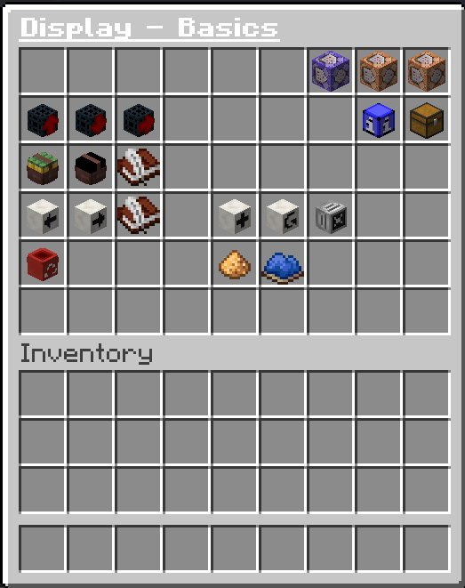
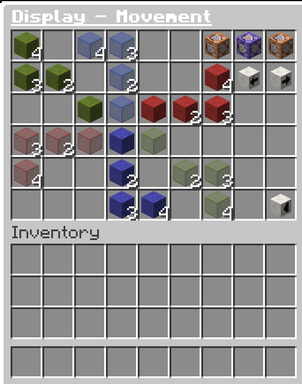
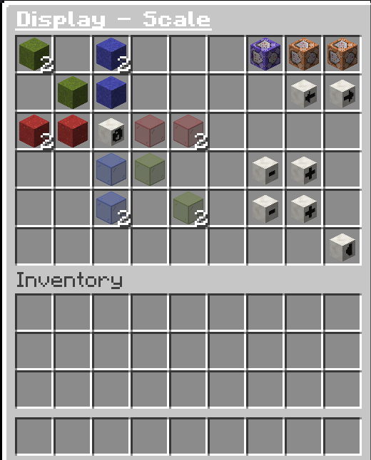
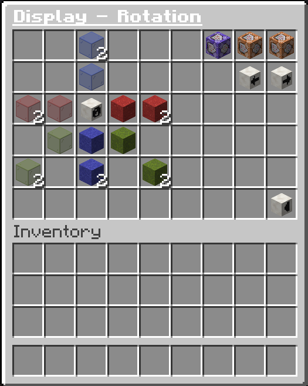
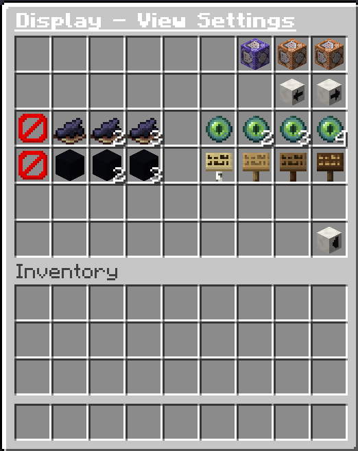
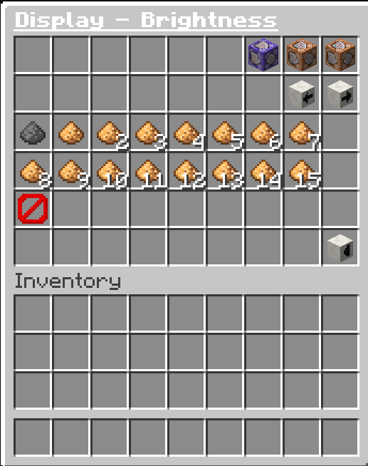
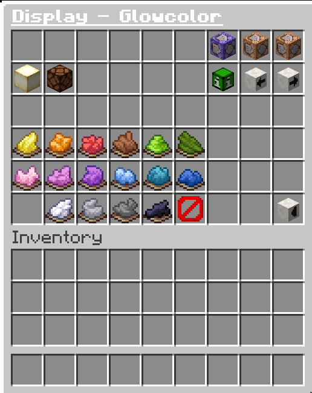
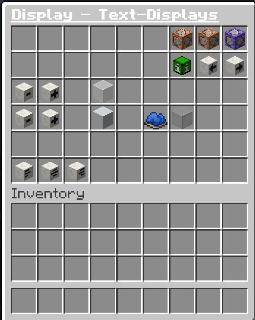
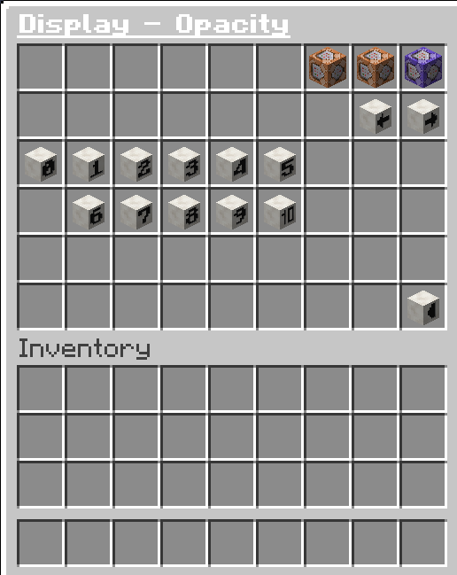
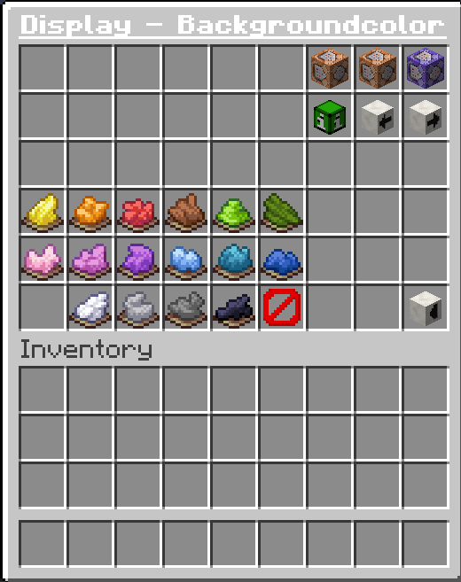

# DisplayChanger

🇬🇧 **English** | 🇩🇪 [Deutsch](Readme.de.md)

DisplayChanger is a Paper server plugin that lets you spawn, edit and save **Display Entities**
(Item Displays, Block Displays and Text Displays) without any external editor — everything is
done in-game, either with chat commands or with a graphical menu.

Use **/display** for every command below.

> Need permission to use any of this? Ask your server admin — see [Permissions](#permissions) for
> the full list of permission nodes.

## Table of contents

- [Using the graphical menu (GUI)](#using-the-graphical-menu-gui)
- [Spawning displays](#spawning-displays)
- [Selecting displays to edit](#selecting-displays-to-edit)
- [Undo](#undo)
- [Duplicating and deleting](#duplicating-and-deleting)
- [Transform: move, scale, rotate](#transform-move-scale-rotate)
- [Appearance: billboard, view range, shadow, brightness](#appearance-billboard-view-range-shadow-brightness)
- [Glow](#glow)
- [Text displays](#text-displays)
- [Compositions (saving layouts)](#compositions-saving-layouts)
- [Moving and rotating a group of displays](#moving-and-rotating-a-group-of-displays)
- [Permissions](#permissions)
- [Region protection (WorldGuard)](#region-protection-worldguard)
- [Resource pack: see-through GUI panel](#resource-pack-see-through-gui-panel)
- [Troubleshooting](#troubleshooting)
- [Changelog](Changelog.md)
- [Examples - Userart](Examples.md)

## Using the graphical menu (GUI)

Most of what's described below is also available as a click-based inventory menu — handy if you
don't want to remember commands. Open it with `/display gui <menu>`, starting from the main menu:

```
/display gui display_basics
```

From there, buttons in the top row jump between sub-menus, and every sub-menu has a "back" button
to return to Basics. Each section below shows the matching GUI menu right next to the commands it
covers, plus a note on where the GUI and the commands differ — the GUI is quick and
preset-based (fixed step sizes, predefined colors, ...), while the commands accept any exact
value and cover a few things the GUI doesn't have a button for at all (e.g. `/display duplicate`,
`/display undo`, setting a Text Display's actual text, or custom RGB/HEX colors).

> **Note:** the menu buttons are currently labelled in German regardless of your `config.yml`
> language setting — the chat messages the plugin sends you still follow that setting normally.

The see-through chest background in the screenshots comes from an optional resource pack — see
[Resource pack: see-through GUI panel](#resource-pack-see-through-gui-panel).

## Spawning displays

**`/display spawn <feet|front|head> [material] [item|block]`**

Spawns a display positioned at your feet, your head, or in front of you.

- If no location is given, the display spawns in front of you.
- If no material is given, the item currently in your main hand is used.
- What you get depends on the item/material:
  - A **block item** (e.g. `STONE`) → a **Block Display**.
  - Any other **item** (e.g. `DIAMOND`) → an **Item Display** showing that item.
  - A **Player Head** with a texture → an **Item Display** showing that exact skin.
  - A **Name Tag** → a **Text Display**. If the name tag has a custom name set (renamed on an
    anvil), that name becomes the display's text; otherwise a placeholder text is used.
- For a material that's given explicitly and supports both forms (any block item), add `item` or
  `block` at the end to force which one you get — e.g. `/display spawn front stone item` spawns
  stone's flat item icon instead of a 3D block. Forcing a combination the material doesn't support
  (e.g. `block` on a non-block item) gives an error instead of spawning anything.

Once spawned, the display is automatically selected and ready to edit — there is no separate
"select" step after spawning.

*GUI:* the `display_basics` menu has one button per spawn location (feet/front/head), always
using the item in your hand — same as the command.

## Selecting displays to edit

DisplayChanger keeps you "logged in" to one display at a time. Whatever you spawn, register, or
switch to becomes the active display for every editing command below.

- **`/display register`** — registers every display within a radius of 5 blocks (configurable)
  around you and selects the first one.
- **`/display switch next`** / **`/display switch previous`** — cycles through your registered
  displays. The currently selected display is briefly highlighted.
- **`/display infoall`** — lists all of your registered displays in chat.
- **`/display info`** — shows detailed information (position, scale, rotation, brightness, glow,
  etc.) about the currently selected display.
- **`/display unregister`** — clears your registered displays and leaves edit mode.

*GUI:* the `display_basics` menu has matching buttons for all of the above (register, switch
previous/next, info for all displays, info for the selected one, and unregister) — full parity
with the commands, no finer control either way.



## Undo

**`/display undo`**

Reverts the last change made to the display you're currently editing, one step at a time. Every
successful edit (scale, rotation, move, brightness, view range, shadow, billboard, glow,
glow color, and text changes) is remembered while you're editing that display.

The undo history is cleared when you switch to another display, run `/display unregister`, or
disconnect — undo only ever applies to the display you are currently editing, and only for the
current session.

*GUI:* there is no undo button anywhere in the menu — undo is command-only.

## Duplicating and deleting

- **`/display duplicate`** — spawns a full copy of the currently selected display (same look,
  transform, glow, shadow, etc.) in front of you, adds it to your registered displays, and selects
  the copy.
- **`/display delete`** — permanently removes the currently selected display.

*GUI:* `display_basics` has a delete button (see screenshot above), but no duplicate button —
duplicating a display is command-only.

## Transform: move, scale, rotate

**Move**

`/display move <x|y|z> <value>` moves the display along a single axis.
`/display move <x> <y> <z>` moves it along all three axes at once.

Prefix the value with `~` for a relative move (e.g. `~1` moves 1 block further); without `~` the
value is an absolute coordinate.

*GUI:* the `display_movement` menu nudges the display west/east, north/south and up/down in fixed
steps of 0.001, 0.01, 0.1 or 1 blocks per click. It's great for quick, precise nudging, but the
command is more flexible: it accepts *any* step size, lets you type an exact absolute coordinate
instead of a relative nudge, and can move all three axes in a single call.



**Center**

`/display center` snaps the display's position to the corner of the block cell it currently
occupies, and adjusts its translation to match the current scale, so it sits centered in that
cell — handy after nudging a display around and wanting it to line up with the block grid again
instead of sitting at an arbitrary fractional position. Works on Block, Item and Text displays;
command-only, no GUI equivalent.

**Scale**

`/display scale <set|add> <x|y|z|all> <value>` sets or adds to the scale on the given axis (or
all axes at once).
`/display scale reset` resets the scale back to the values the display was spawned with.

*GUI:* the `display_scale` menu grows/shrinks width, height and depth independently (or
uniformly) in fixed steps of 0.1 or 1, plus a reset button. It only ever *adds to* the current
scale — jumping straight to an exact scale value (`set`) is command-only.



**Rotation**

`/display rotation <set|add> <pitch|roll|yaw|all> <value>` sets or adds to the rotation on the
given axis.
`/display rotation <set|add> <x> <y> <z>` sets or adds to yaw, pitch and roll all at once.
`/display rotation reset` resets the rotation back to the values the display was spawned with.

*GUI:* the `display_rotation` menu tilts/turns the display in fixed steps of 1° or 10° per click
(pitch, yaw and roll each have their own buttons), plus a reset button. As with scale, it only
adds to the current rotation — setting an exact angle, or setting all three axes at once, is
command-only.



## Appearance: billboard, view range, shadow, brightness

**Billboard (alignment)**

`/display billboard <mode>` controls how the display turns to face you:

| Mode         | Behaviour                                          |
| ------------ | --------------------------------------------------- |
| `fixed`      | Display never turns — stays exactly as rotated.      |
| `vertical`   | Display turns to face you, but only around the vertical (up/down) axis. |
| `horizontal` | Display turns to face you, but only around the horizontal axis. |
| `center`     | Display always fully faces you, on every axis.       |

**View range**

`/display viewrange <value>` sets how far away (as a percentage) the display can still be seen,
combining both the server-side and client-side render distance settings (whichever is smaller
wins).

**Shadow**

`/display shadowradius <value>` sets the size of the display's shadow.
`/display shadowstrength <value>` sets the strength/darkness of the shadow.
A shadow is only visible once **both** values are greater than 0.

*GUI:* the `display_settings` menu covers all three of the above in one place — billboard has all
four modes as buttons (full parity with the command), while view range (25/50/75/100%) and shadow
radius/strength (preset buttons) only offer a handful of fixed values plus a reset. Any other
percentage or shadow value needs the command.



**Brightness**

`/display brightness <value>` sets the display's brightness, from `0` (fully dark) to `15` (fully
lit, ignores the surrounding light level).
`/display brightness reset` resets it back to the brightness the display was spawned with.

*GUI:* the `display_brightness` menu has one button per brightness level (0–15) plus reset — since
brightness only ever has 16 possible values in Minecraft, the GUI already covers the full range.



## Glow

`/display glow <true|false>` turns the outline glow effect on or off.

`/display glowcolor <colorname>` sets the glow color to one of the predefined dye colors:
`black`, `blue`, `brown`, `cyan`, `gray`, `green`, `light_blue`, `light_gray`, `lime`, `magenta`,
`orange`, `pink`, `purple`, `red`, `white`, `yellow`.

`/display glowcolor rgb <r> <g> <b>` sets a custom RGB glow color.
`/display glowcolor hex <#RRGGBB>` sets a custom HEX glow color.
`/display glowcolor reset` resets the glow color to default.

Glow and glow color are **not available for Text Displays** — text displays don't have an outline
to glow.

*GUI:* the `display_glowcolors` menu toggles glow on/off and offers all 16 predefined dye colors
plus reset — custom RGB or HEX colors are command-only.



## Text displays

These commands only work while a **Text Display** is selected (see [Spawning
displays](#spawning-displays) — hold a Name Tag to spawn one).

- **`/display text settext <text>`** — sets the display's text, replacing whatever was there
  before.
- **`/display text addtext <text>`** — appends text to the existing text instead of replacing it.

  Both commands understand [MiniMessage](https://docs.advntr.dev/minimessage/format.html)
  formatting, so you can write things like:

  ```
  /display text settext <gold><bold>Welcome!
  /display text addtext <newline><gray>to the server
  ```

- **`/display text alignment <left|center|right>`** — sets the text alignment.
- **`/display text linewidth <set|add> <value>`** — sets or adds to the maximum line width before
  the text wraps.
- **`/display text seethrough <true|false>`** — makes the text visible through walls (`true`) or
  only when in line of sight (`false`).

*GUI:* the `display_text` menu covers line width (±5/±10 steps only — no exact `set`), see-through
(full parity) and alignment (full parity). **There is no button to actually set or add the text
itself** — `settext`/`addtext` are command-only.



**Opacity**

`/display text opacity <0-100>` sets how opaque the text is, as a percentage.

*GUI:* the `display_text_opacity` menu offers fixed 10% steps (0/10/20/…/100). Any other exact
percentage needs the command.



**Background color**

`/display text backgroundcolor <colorname [alpha]|rgb <r> <g> <b> [alpha]|hex <#RRGGBB[AA]>|reset>`
sets the background panel color behind the text. Colorname, RGB and HEX all accept an optional
alpha value from `0` (fully invisible) to `255` (fully opaque, the default) — for HEX it's two
extra digits on the end (`#RRGGBBAA`) instead of a separate argument.

`reset` restores Minecraft's built-in translucent background — it does **not** make the background
invisible. To hide the background entirely, set alpha to `0` instead, e.g.
`/display text backgroundcolor black 0` or `/display text backgroundcolor hex #00000000`.

*GUI:* the `display_text_backgroundcolors` menu offers the same 16 predefined colors plus reset —
custom RGB/HEX and alpha are command-only.



## Compositions (saving layouts)

Compositions let you save a group of displays as a named, reusable layout — like a WorldEdit
schematic, but scoped to display entities. Requires the [WorldEdit](https://enginehub.org/worldedit)
plugin. There is no GUI menu for compositions — everything below is command-only.

1. Select the area with WorldEdit (`//pos1`, `//pos2`) around the displays you want to save.
2. Run **`/display composition save <name>`**. Every display inside that selection is captured —
   full position/rotation/scale, glow, shadow, brightness, view range, and (for text displays)
   text/alignment/background settings.
3. Later, stand wherever you want the layout and run **`/display composition load <name>`** — the
   whole layout is pasted relative to your current position and facing, so it looks the same no
   matter where you paste it.

Other composition commands:

- **`/display composition list`** — lists your saved compositions.
- **`/display composition delete <name>`** — deletes one of your saved compositions.

Notes:

- Compositions are private — you can only save, load, list, or delete your own.
- Names may only contain lowercase letters, numbers, `-` and `_` (max 32 characters).
- Saving requires build rights in the selected area (see
  [Region protection](#region-protection-worldguard)) and requires WorldEdit to be installed;
  loading, listing, and deleting a composition do not require WorldEdit.
- Don't have WorldEdit's own selection permission? Use `/display selection pos1` and
  `/display selection pos2` instead of `//pos1`/`//pos2` — they set the same selection from your
  current position, gated only by `displaychanger.selection.pos`.

## Moving and rotating a group of displays

Beyond editing one display at a time, you can register every display inside a WorldEdit selection
as a fixed group and move or rotate all of them together as a single rigid body. Requires the
[WorldEdit](https://enginehub.org/worldedit) plugin. There is no GUI menu for this — everything
below is command-only.

1. Select the area with WorldEdit (`//pos1`, `//pos2`) around the displays you want to move or
   rotate as a group.
2. Run **`/display selection register`**. Every display inside that selection becomes the group;
   the center of the selection is captured as the group's pivot point.
3. **`/display selection move <dx> <dy> <dz>`** — moves every display in the group by the given
   offset (relative, in blocks).
4. **`/display selection rotate <yaw|pitch|roll|all> <degrees>`** — rotates every display in the
   group together around the pivot captured at registration; the pivot moves with the group.

Other selection commands:

- **`/display selection unregister`** — clears the current group registration.

Notes:

- `/display undo` also undoes a group move/rotate, same as it undoes a single-display edit — it
  automatically picks whichever, a single edit or a group action, happened most recently.
- Two server limits apply, both configurable by the admin in `config.yml`: a selection can affect
  at most a set number of displays at once (300 by default), and a single move is capped at a set
  distance per axis (64 blocks by default).
- Registering a group requires build rights across the whole selected area; moving requires build
  rights at both the current and destination positions, and rotating requires build rights across
  the area the group sweeps through (see [Region protection](#region-protection-worldguard)).
- Don't have WorldEdit's own selection permission? Use `/display selection pos1` and
  `/display selection pos2` instead of `//pos1`/`//pos2` — they set the same selection from your
  current position, gated only by `displaychanger.selection.pos`.

## Permissions

Ask your server admin for these if a command doesn't work for you:

| Permission                          | Grants access to                                    |
| ------------------------------------ | ---------------------------------------------------- |
| `displaychanger.default`            | The `/display` command and all of its subcommands, including the GUI. |
| `displaychanger.composition.save`   | `/display composition save` and `/display composition delete`. |
| `displaychanger.composition.load`   | `/display composition load` and `/display composition list`. |
| `displaychanger.selection.register` | `/display selection register` and `/display selection unregister`. |
| `displaychanger.selection.move`     | `/display selection move`. |
| `displaychanger.selection.rotate`   | `/display selection rotate`. |
| `displaychanger.selection.pos`      | `/display selection pos1` and `/display selection pos2` — sets a WorldEdit selection point without needing WorldEdit's own permission. |
| `displaychanger.reload`             | `/display reload` (admin-only: reloads `config.yml`). |

## Region protection (WorldGuard)

If the server has [WorldGuard](https://worldguard.enginehub.org/) installed, every display action
(spawning, editing, deleting, saving a composition, ...) requires build rights in the region
you're standing in — you need to be the region owner, a region member, or a server operator.
Without WorldGuard, only the permissions above apply.

## Resource pack: see-through GUI panel

The [graphical menu](#using-the-graphical-menu-gui) opens as a large chest-style inventory, which
can partially block your view of the display you're editing. This repository includes an optional
resource pack that makes that chest texture transparent, so you can see the display behind the
menu while you edit it:

[`invisible-chests-datapack/InvisibleChests_1.21.11.zip`](invisible-chests-datapack/InvisibleChests_1.21.11.zip)

Download it and add it as a resource pack on your client (or have your server push it) to use it.

## Troubleshooting

| Message                                   | What it means                                                        |
| ------------------------------------------ | ---------------------------------------------------------------------- |
| *No displays registered*                  | Run `/display register` (or spawn a display) first.                   |
| *No display selected*                     | Register or switch to a display before editing.                       |
| *You do not have build rights here*       | You're missing WorldGuard region rights (or the permission node) for this spot. |
| *Display is too far away*                 | Move closer to the display you're editing.                            |
| *Invalid material*                        | The item/material you tried to spawn with isn't valid, or is on the server's hidden-items list. |
| *This command can only be applied to text displays* | You ran a `text`/`glow` command while a non-matching display type was selected. |
| *No WorldEdit selection found*            | Run `//pos1` and `//pos2` (or `/display selection pos1`/`pos2` if you don't have WorldEdit's own permission) before saving a composition or registering a selection group. |
| *This feature requires WorldEdit*         | WorldEdit isn't installed on this server.                             |
| *Invalid composition name*                | Only lowercase letters, numbers, `-` and `_` are allowed (max 32 characters). |
| *No selection group registered*           | Run `/display selection register` before `move`/`unregister`.        |
| *Too many displays in the selection*      | Narrow your WorldEdit selection — it exceeds the server's configured limit. |
| *The move distance exceeds the configured limit* | Split the move into smaller steps, or ask an admin to raise `selection_move_radius`. |
| *Cannot spawn ... as a ... display*       | The material you spawned doesn't support the `item`/`block` type you forced. |

**Why can't I build here?** — Check your WorldGuard region rights, or ask an OP.

**Why is my command rejected even though I have permission?** — Usually you have no display
selected, or the value you gave is outside the server's configured limits.
